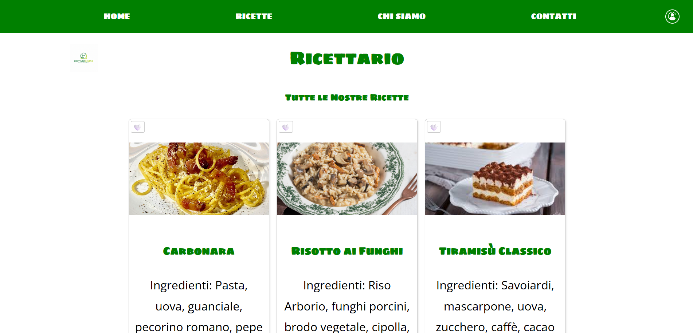

# 🍳 Il Mio Ricettario Digitale

Un'applicazione web full-stack sviluppata per gestire, condividere e salvare le proprie ricette preferite. Il progetto integra un'interfaccia utente responsive e accessibile con un backend solido basato su architettura RESTful e un database relazionale.

## ✨ Funzionalità Principali
* **Autenticazione Sicura:** Sistema di registrazione e login gestito tramite token JWT (JSON Web Token).
* **Gestione Ricette (CRUD):** Creazione, visualizzazione, modifica ed eliminazione delle ricette, con tracciamento dell'autore (`id_autore`).
* **Upload Immagini:** Caricamento delle foto dei piatti gestito lato server tramite `multer`, con generazione di nomi file univoci e salvataggio fisico su disco.
* **Sistema di Preferiti:** Possibilità per ogni utente di aggiungere o rimuovere le ricette dai propri preferiti (rappresentato dalla metafora visiva del cuore), gestito tramite una tabella ponte relazionale.
* **UI/UX Responsive:** Interfaccia fluida costruita con CSS Grid e Flexbox, ottimizzata per il mobile tramite Media Queries e progettata tenendo conto dei principi di accessibilità (gerarchia visiva, contrasto colori, `tabindex`).

## 🛠️ Stack Tecnologico
* **Frontend:** HTML5, CSS3 (animazioni, transizioni, custom properties), JavaScript Vanilla (Fetch API, DOM manipulation).
* **Backend:** Node.js, Express.js.
* **Database:** MySQL.
* **Middleware & Sicurezza:** `jsonwebtoken` per l'autenticazione delle rotte, `multer` per il parsing dei form `multipart/form-data`, `bcrypt` per l'hashing delle password, variabili d'ambiente (`dotenv`) per oscurare i dati sensibili.

## 🗄️ Architettura del Database
Il database è progettato per garantire l'integrità dei dati ed è strutturato su tre tabelle principali:
* `utenti`: Contiene `id` (Auto Increment), `username`, `email`, `password` e `data_iscrizione` (Timestamp).
* `ricette`: Contiene i dettagli del piatto (`nome`, `ingredienti`, `preparazione` in formato TEXT) e il percorso fisico dell'immagine salvato come VARCHAR.
* `preferiti`: Tabella di giunzione che risolve la relazione "Molti-a-Molti" tra utenti e ricette, implementando vincoli di `ON DELETE CASCADE` per mantenere il database pulito in caso di eliminazione di un profilo.
